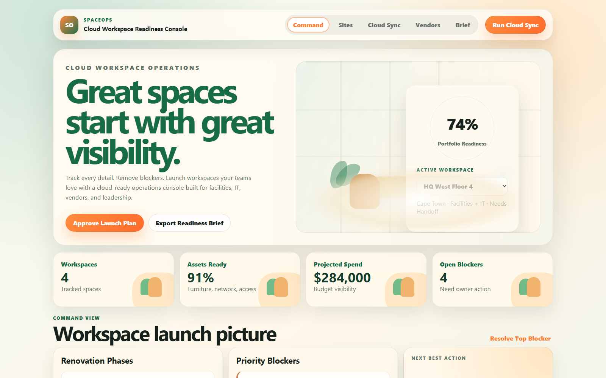
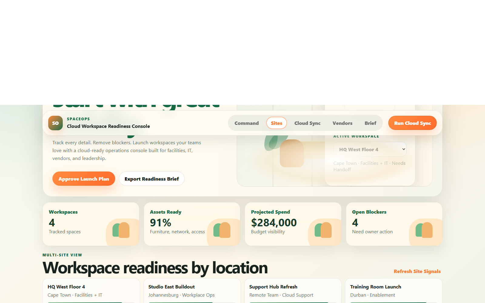
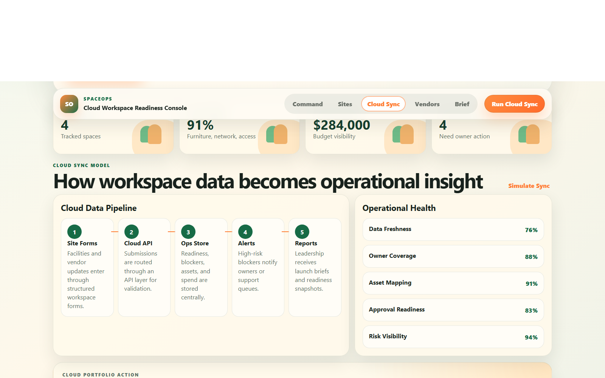
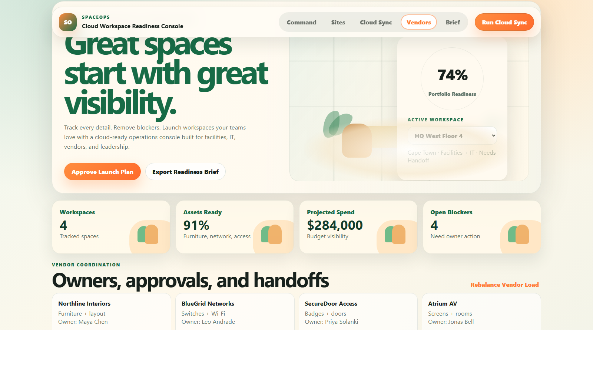
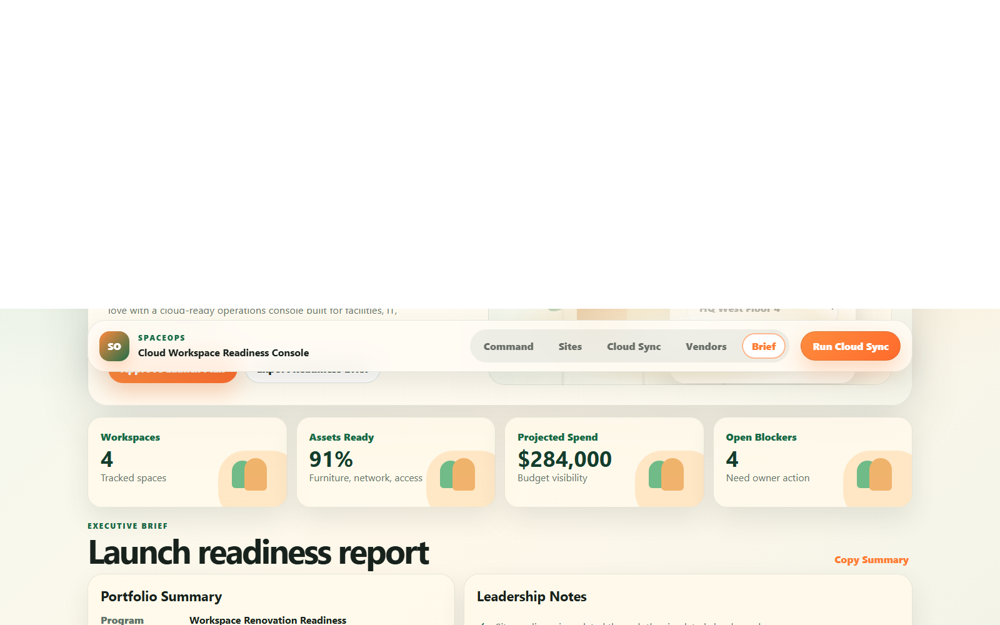

# SpaceOps Cloud Workspace Readiness And Renovation Control Console

## Overview

SpaceOps is a cloud-ready workspace readiness and renovation operations console built from the original Workspace-Renovation-Planning-Dashboard project.

The upgraded project includes a Team Horizon-style frontend, a Node.js and Express backend, API routes, JSON persistence, readiness scoring, simulated cloud sync, vendor workflow logic, blocker resolution workflows, observability endpoints, Docker support, and GitHub Actions CI.

## Why This Project Supports Cloud Work

SpaceOps models a common cloud operations pattern:

1. Business data enters through forms, vendor portals, ticket queues, or API submissions.
2. A backend API validates and stores the data.
3. A scoring service turns raw updates into operational health signals.
4. A sync engine simulates cloud ingestion from multiple sources.
5. A dashboard gives teams and leadership real-time visibility.
6. Health and metrics endpoints make the service easier to monitor.
7. Docker and GitHub Actions prepare the project for cloud deployment workflows.

This demonstrates practical skills used in cloud support, DevOps support, SaaS operations, internal tools, and technical support engineering.

## Key Features

- Team Horizon visual dashboard
- Express backend API
- JSON persistence layer
- Readiness scoring engine
- Simulated cloud sync workflow
- Multi-site workspace tracking
- Vendor coordination board
- Blocker resolution workflow
- Vendor load rebalance workflow
- Executive readiness report
- Health endpoint
- Metrics endpoint
- Dockerfile
- docker-compose.yml
- GitHub Actions CI
- Frontend fallback mode if backend is offline

## Screenshot Gallery

### Command Dashboard

### Multi-Site Readiness

### Cloud Sync Workflow

### Vendor Coordination

### Executive Brief

## API Endpoints

### Health and Observability

- GET /api/health
- GET /api/metrics

### Dashboard and Scoring

- GET /api/dashboard
- GET /api/readiness-summary

### Sites

- GET /api/sites
- GET /api/sites/:id
- POST /api/sites
- PATCH /api/sites/:id

### Blockers

- GET /api/blockers
- POST /api/blockers
- PATCH /api/blockers/:id/resolve

### Vendors

- GET /api/vendors
- PATCH /api/vendors/:id
- POST /api/vendors/rebalance

### Cloud Sync

- GET /api/cloud-sync/status
- GET /api/sync-events
- POST /api/cloud-sync/run

### Reports

- GET /api/reports/readiness.txt
- POST /api/reset-demo-data

## Tech Stack

- HTML
- CSS
- JavaScript
- Node.js
- Express
- JSON file persistence
- Docker
- GitHub Actions

## How To Run Locally

Install dependencies:

    npm install

Start the backend and frontend:

    npm start

Open:

    http://localhost:3000

Health check:

    http://localhost:3000/api/health

Metrics:

    http://localhost:3000/api/metrics

## Docker Run

    docker compose up --build

Then open:

    http://localhost:3000

## Safe Demo Boundary

This is a portfolio demo using synthetic workspace data. It does not connect to real vendors, buildings, access systems, employees, budgets, or private company data.

## Final Project Name

SpaceOps-Cloud-Workspace-Readiness-And-Renovation-Control-Console
